# C Programming Concepts — Illustrated Guide

## Table of Contents
- [1. Hexadecimal Representation in C](#1-hexadecimal-representation-in-c)
- [2. Address Range Represented by 20 Bits](#2-address-range-represented-by-20-bits)
- [3. Difference between TSR and TSO Programs](#3-difference-between-tsr-and-tso-programs)
- [4. Warning Codes in C Programming](#4-warning-codes-in-c-programming)
- [5. Memory Cells in Computer](#5-memory-cells-in-computer)
- [6. Residence Memory in C Programming](#6-residence-memory-in-c-programming)
- [7. Physical Address in Computer](#7-physical-address-in-computer)
- [8. Segmentation in Operating System](#8-segmentation-in-operating-system)
- [9. Offset Address Meaning & Example](#9-offset-address-meaning--example)
- [10. Data Segment in C](#10-data-segment-in-c)
- [11. Definition of Variable in C](#11-definition-of-variable-in-c)
- [12. Identifier Naming Rules in C](#12-identifier-naming-rules-in-c)
- [13. Value of Variable in C](#13-value-of-variable-in-c)
- [14. Address of a Variable in C](#14-address-of-a-variable-in-c)
- [15. Declaration of a Variable in C](#15-declaration-of-a-variable-in-c)
- [16. Introducing C Data Types](#16-introducing-c-data-types)
- [17. Primitive Data Types in C](#17-primitive-data-types-in-c)
- [18. C Data Type Modifiers](#18-c-data-type-modifiers)
- [19. Default Modifiers in C](#19-default-modifiers-in-c)
- [20. Default Data Types in C](#20-default-data-types-in-c)
- [21. Size of Data Types in C](#21-size-of-data-types-in-c)
- [22. Range of Data Types in C](#22-range-of-data-types-in-c)
- [23. Const Modifier in C](#23-const-modifier-in-c)

---

## 1. Hexadecimal Representation in C

| Hexadecimal | Decimal | Binary  |
|-------------|---------|---------|
| 0           | 0       | 0000    |
| 1           | 1       | 0001    |
| 2           | 2       | 0010    |
| 3           | 3       | 0011    |
| 4           | 4       | 0100    |
| 5           | 5       | 0101    |
| 6           | 6       | 0110    |
| 7           | 7       | 0111    |
| 8           | 8       | 1000    |
| 9           | 9       | 1001    |
| A           | 10      | 1010    |
| B           | 11      | 1011    |
| C           | 12      | 1100    |
| D           | 13      | 1101    |
| E           | 14      | 1110    |
| F           | 15      | 1111    |

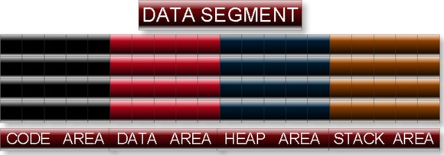

> **Tip:** Binary `11000111110101` = Hex `31F5`  
> **Conversion:** Group 4 bits from right to left and replace with hex digit.

---

## 2. Address Range Represented by 20 Bits
- Minimum Address: `0x00000`  
- Maximum Address: `0xFFFFF`  
- Range: **1 MB memory**  

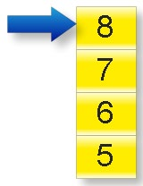

---

## 3. Difference between TSR and TSO Programs

| Feature | TSO (Terminate & Stay Outside) | TSR (Terminate & Stay Resident) |
|---------|-------------------------------|-------------------------------|
| **Memory Release** | Frees main memory after execution | Does not release RAM after execution |
| **Examples** | MS Paint, Notepad, Turbo C Compiler | Antivirus programs |

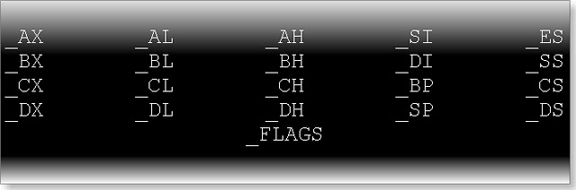

---

## 4. Warning Codes in C Programming
Common warnings include:
- Division by zero (`zdi`)
- Redefinition of macro (`dup`)
- Suspicious pointer conversion (`sus`)


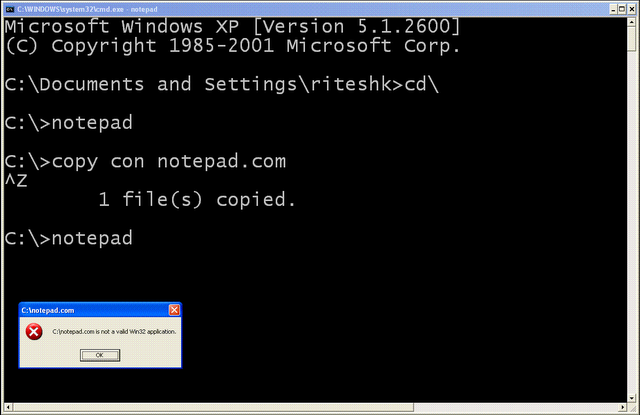

---

## 5. Memory Cells in Computer

RAM is divided into equal parts called **memory cells**.

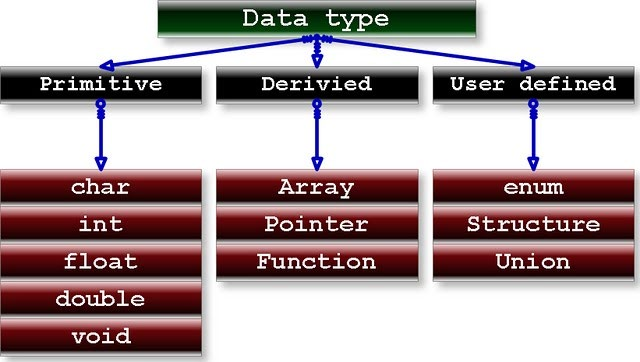

- Each cell stores **1 byte**.
- A character uses 1 cell, an integer uses 2 cells, and a float uses 4 cells.
- Each cell has a unique address (always increasing).

```c
int a = 4; // stored at e.g. 0x5000
```
Next cell = 0x5001.

---

## 6. Residence Memory in C Programming

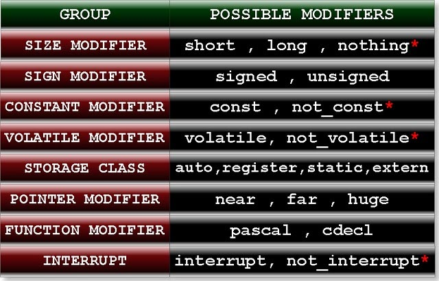

- Turbo C 3.0 has **1MB residence memory**.
- Executed programs are stored here.

---

## 7. Physical Address in Computer

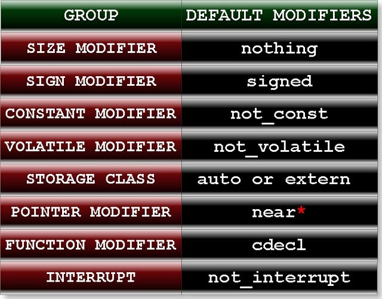

- In Turbo C 3.0, 20-bit addresses (0x00000–0xFFFFF).
- Compiler decides addresses, not the programmer.

```c
#include<stdio.h>
int main(){
    int a;
    printf("%x",&a); // unpredictable but within 0x00000–0xFFFFF
    return 0;
}
```

---

## 8. Segmentation in Operating System

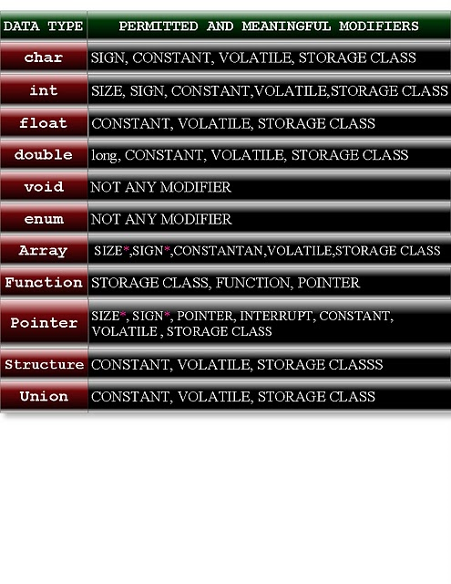

- 1MB RAM divided into 16 segments of 64KB each.
- Called **segmentation**.

---

## 9. Offset Address Meaning & Example

Memory address = Segment Number + Offset Address

- Segment: 4 bits  
- Offset: 16 bits  

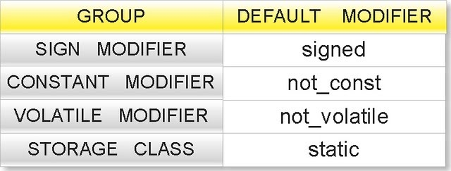

Example Program:
```c
#include<stdio.h>
int main(){
    int x;
    printf("%u ",&x); // offset address
    return 0;
}
```

---

## 10. Data Segment in C


Segment 8 (data segment) is split into 4 areas:
1. **Stack Area** — automatic variables (LIFO).
2. **Data Area** — static & extern variables (permanent).
3. **Heap Area** — dynamic memory allocation.
4. **Code Area** — program instructions.

**Stack Example:**
```c
#include<stdio.h>
int main(){
  for(int i=0;i<3;i++){
    int a=5;
    printf("%d",a);
  }
  return 0;
}
// Output: 5 5 5
```
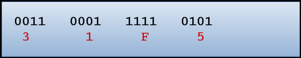

---

## 11. Definition of Variable in C

A variable is a **named container** for data.

Types:
- Single value (int, char)
- Multiple similar (arrays)
- Multiple dissimilar (struct, union)

Attributes: **Name**, **Value**, **Address**.

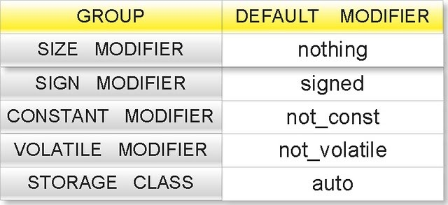
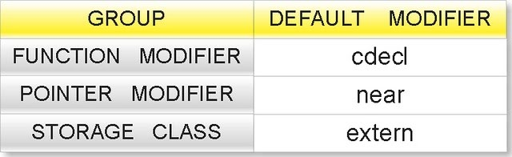
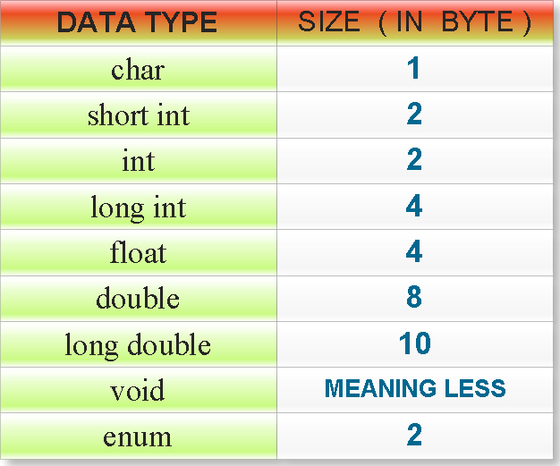


---

## 12. Identifier Naming Rules in C

- Use letters, digits, underscore.  
- Cannot start with digits.  
- Cannot use keywords.  
- Case-sensitive.  
- Only first 32 characters significant.  

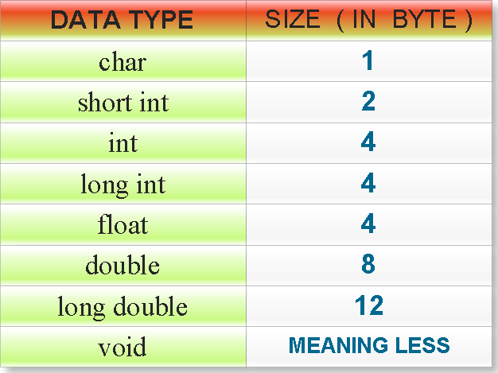

---

## 13. Value of Variable in C
Assigned using `=` or other assignment operators (`+=`, `-=`, etc.).

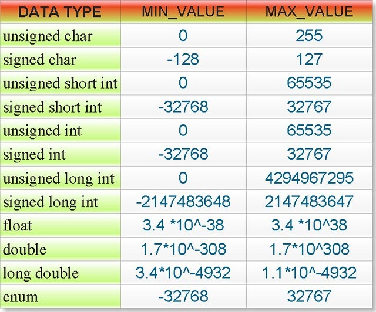

---

## 14. Address of a Variable in C

Use `&` to get address. Use `%u` or `%x` to print.

```c
#include<stdio.h>
int main(){
    int a=5;
    printf("Address: %u",&a);
    return 0;
}
```


---

## 15. Declaration of a Variable in C

Tells compiler about name & type, no memory allocated.

```c
extern int a; // declaration only
```

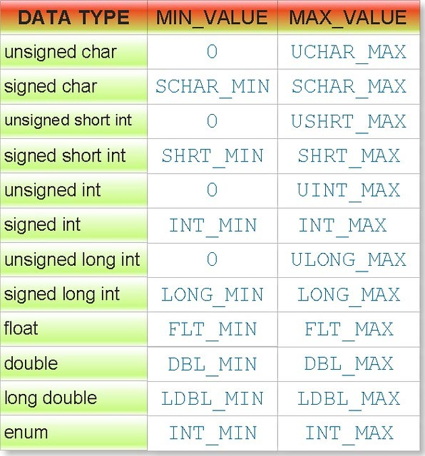

---

## 16. Introducing C Data Types

3 Categories: **Primitive**, **Derived**, **User-defined**.

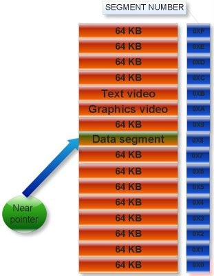

---

## 17. Primitive Data Types in C

- Integral: `char`, `int`
- Real: `float`, `double`
- Void: `void`

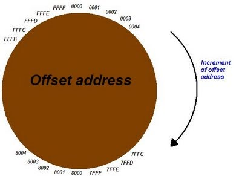

---

## 18. C Data Type Modifiers

Modify data type meaning (size, sign, storage, etc.).

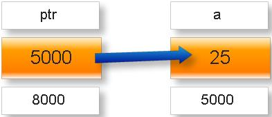

---

## 19. Default Modifiers in C

- Local variables: `auto` by default.
- Global variables: `extern` by default.

---

## 20. Default Data Types in C

If size/sign/storage specified without type, defaults to `int`.

```c
long a=25; // same as long int a=25;
```

---

## 21. Size of Data Types in C

Varies with compiler (16-bit vs 32-bit).

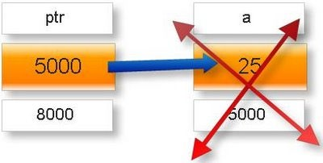

---

## 22. Range of Data Types in C

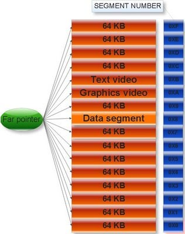

---

## 23. Const Modifier in C

Makes variables constant (cannot change after initialization).

```c
const int i=10;
```

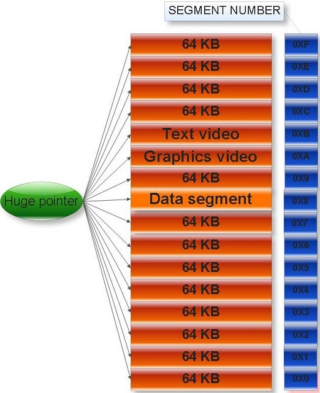

---

